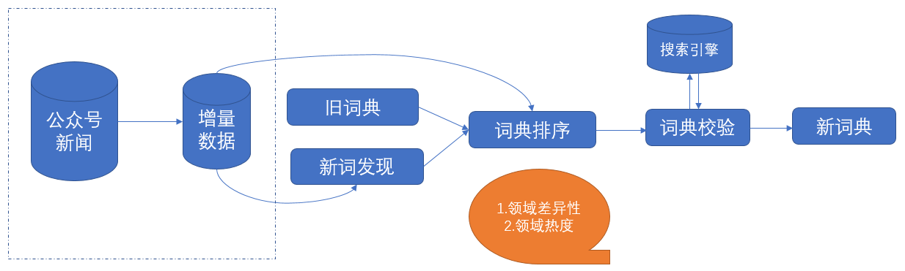

# A approach for domain dictionary automatic mining.
The overall pipeline as below:

### Requirements
- pymongo 3.7.3
- requests 2.18
- jieba 0.39
- beautifulsoup4 4.6.0
- Python >= 3.6

### Usage
run the script `./update_dict.sh` to generate all domain's dictionaries.

### Note
- Make sure your machine can query the online Mongo database.
- Internet is needed to crawling the online dict and validation module.
